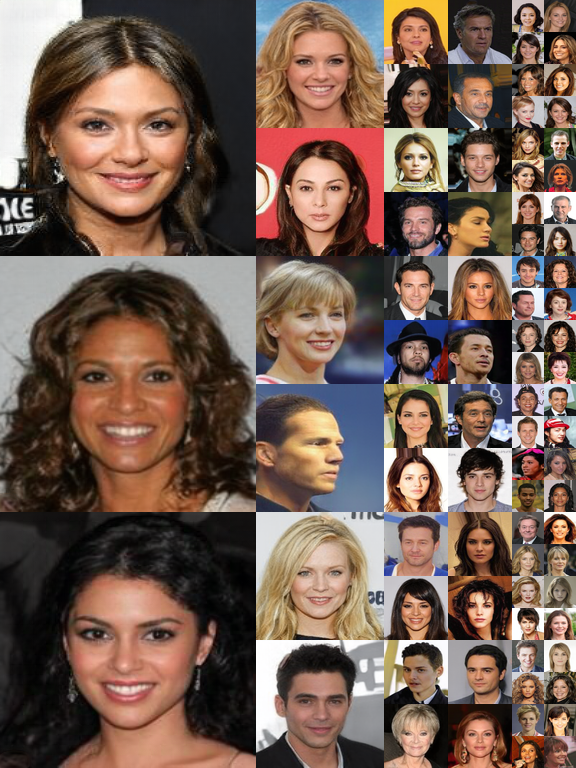
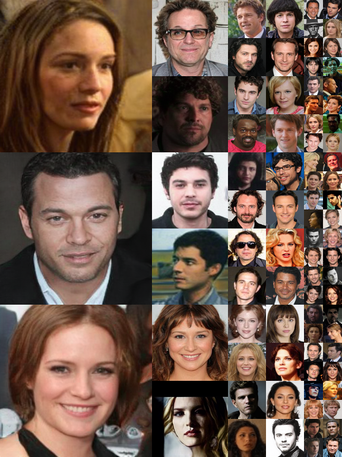

# Re-training StyleGAN - StyleGAN models

The official implementation of StyleGAN (https://github.com/NVlabs/stylegan) is used, to train it on CelebA and Casia-WebFace at a 256x256 resolution. 
The models / checkpoints for these two are given in the links below. How the models are generated can be found in detail in: https://arxiv.org/abs/2003.10847 


Dataset          | Resolution | Model
-----------------|------------|-----------
CelebA           | 256&times;256  | [Link](https://drive.google.com/open?id=1wQJafRmBOmhQ9E4-AlYFtdXk4IIXtTmJ)  
CASIA-Webfaces   | 256&times;256  | [Link](https://drive.google.com/open?id=1qnaD8EVg2PZJvUQgAgGFbgb94zPGaaFn)

* 2 GPUs RTX 2080 Ti 
* Training time: 12 days & 13 hours.


## Evaluating quality and disentanglement 

| Metric    | StyleGAN on CelebA | StyleaGAN on CASIA-Webface | Description 
| :-----    | :---      | :-----   | :----------
| fid50k    | 4.7842   | 4.5992   | Fr&eacute;chet Inception Distance using 50,000 images.
| ppl_zfull | 191.9051    | 258.4270 | Perceptual Path Length for full paths in *Z*.
| ppl_wfull | 68.6066    | 81.7605 | Perceptual Path Length for full paths in *W*.
| ppl_zend  | 190.5838    | 259.5282 | Perceptual Path Length for path endpoints in *Z*.
| ppl_wend  | 56.4555    | 74.2621 | Perceptual Path Length for path endpoints in *W*.
| ls        | z: 143.2236<br>w: 2.5235   | z: 109.7136<br>w: 3.1748 | Linear Separability in *Z* and *W*.


## Sample Images




**Picture:** *Uncurated set of images produced by the StyleGAN model trained on CelebA.*



**Picture:** *Uncurated set of images produced by the StyleGAN model trained on CASIA-Webfaces.*


## Citations - Acknowledgements

If you use any of these models for your research ,please consider citing:

The StyleGAN paper (https://arxiv.org/abs/1812.04948):
```
@inproceedings{karras2019style,
  title={A style-based generator architecture for generative adversarial networks},
  author={Karras, Tero and Laine, Samuli and Aila, Timo},
  booktitle={Proceedings of the IEEE Conference on Computer Vision and Pattern Recognition},
  pages={4401--4410},
  year={2019}
}
```

Our Publication describing how the provided models are generated. The paper can be found in : https://arxiv.org/pdf/2003.10847

```
@article{varkarakis2020re,
  title={Re-Training StyleGAN--A First Step Towards Building Large, Scalable Synthetic Facial Datasets},
  author={Varkarakis, Viktor and Bazrafkan, Shabab and Corcoran, Peter},
  journal={arXiv preprint arXiv:2003.10847},
  year={2020}
}
```
